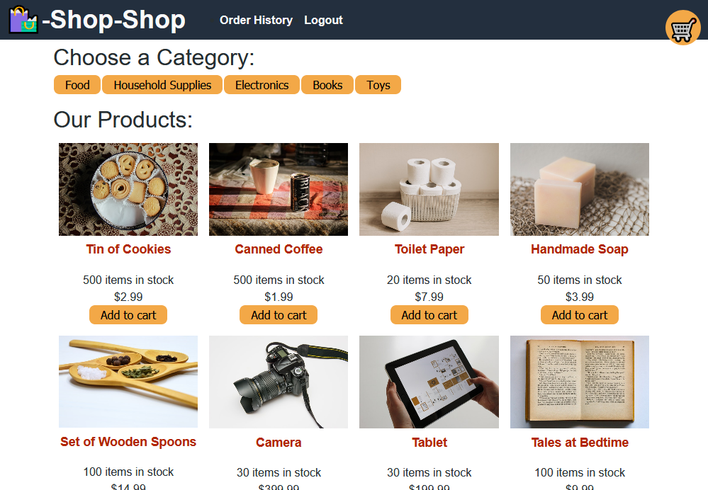

# Shop-Shop

## Description

A demo ecommerce site using React and Redux

## Made with
- React
- Redux
- GraphQL
- Stripe
- Apollo server
- JSON Web Tokens
- Node
- Express
- MongoDB
- Mongoose


## Installation

To install necessary dependencies, run the following command:

```
npm i
```

## Usage

Run the development build by using
```
npm start
```

Or view the live production app on Heroku by clicking the image below. If you use the checkout function, fake credit card information can be used as Stripe is being accessed in test mode.

[](https://guarded-caverns-83236.herokuapp.com/)
